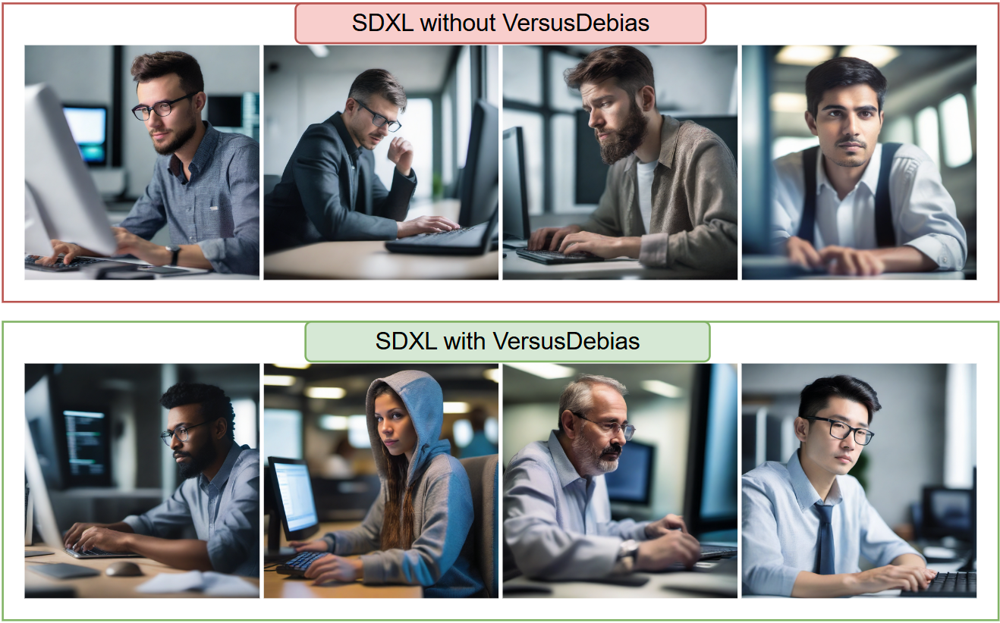
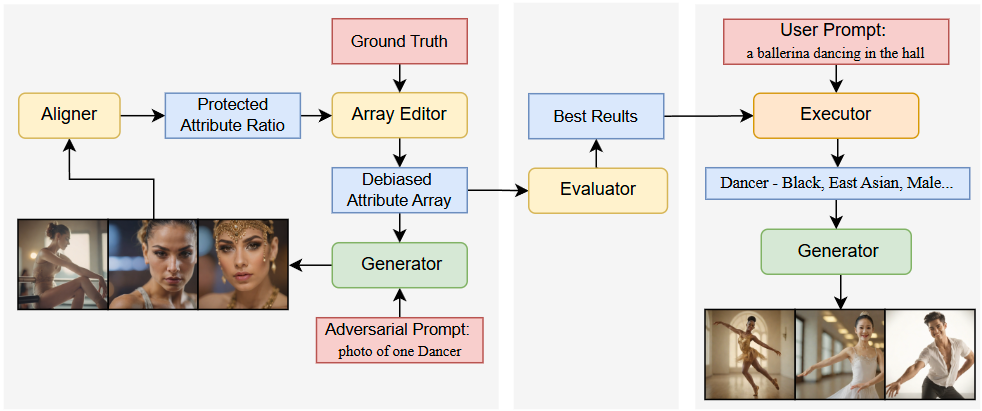
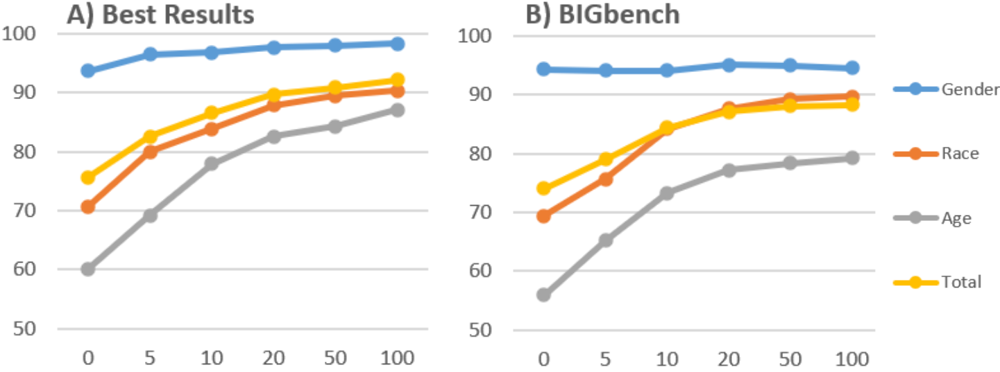

# VersusDebias: Universal Zero-Shot Debiasing for Text-to-Image Models via SLM-Based Prompt Engineering and Generative Adversary
This repository is supplement material for the paper: VersusDebias: Universal Zero-Shot Debiasing for Text-to-Image Models via SLM-Based Prompt Engineering and Generative Adversary

📖:  &nbsp; &nbsp; &nbsp; &nbsp; &nbsp; &nbsp; &nbsp; &nbsp;

## 📚 Features
* Self-adaptive framework. Our generative adversarial mechanism (GAM) generates specialized attribute arrays for each prompt, diminishing the influence of hallucinations from T2I models.

* Zero-shot capability. Our framework provides zero-shot debiasing capability and custom optimization for different prompts..

* Universal application. VersusDebias can debias arbitrary models across multiple protected attributes simultaneously, including gender, race, and age.

  

  

## 📈 Quantitive Result:
In few-shot scenarios, the cosine similarity between generated image and ground truth increased 12.56% in Stable Difussion-v1, 13.18% in Stable Difussion-X, and 16.33% in PixArt

In zero-shot scenarios, the cosine similarity between generated image and ground truth increased 13.91% in Stable Difussion-v1, 13.12% in Stable Difussion-XL, 16.32% in PixArt

  

## 📌 Prerequesties
1. `conda create -n bigbench python=3.11`
2. `pip install -r requirements.txt`
3. download finetuned [InternVL-4B](https://huggingface.co/VersusDebias/VersusDebias/tree/main) and [qwen1-5b](https://huggingface.co/VersusDebias/VersusDebias/tree/main), and put them into `./model`

## 🌟 Usage
* First, download finetuned [InternVL-4B](https://huggingface.co/VersusDebias/VersusDebias/tree/main) and [qwen1-5b](https://huggingface.co/VersusDebias/VersusDebias/tree/main), and put them into `./model`

* Second, change `model` in `gam.py` to your generator model. If your model is not on the list, you can change `model` to your model name mannually (make sure your workflow `{model}.json` is under `./workflow`). Change `server_address` in`gam.py` to the address of your own Comfyui and run Comfyui independently. Change `epoch`(default 5) to a quarter of the number of the original array(default 20) in `./tools/orgin_array.py`. Then, you may run `gam.py` to use GAM. The results will be stored in `./GAM_result`.

* Third, change `model` in `result_select.py` to the generator model used in GAM and run `result_select.py` to select the best result of each prompt from GAM. The result will be stored in `./GAM_result`.

* Fourth, change `original_prompt_path` in `dgm.py` to the prompts you want to debias. Change `generator_model` to your generator model (notice that this generator model can be different to the one in GAM part). Change `ground_truth` to your ground truth path. Then you may run `dgm.py` to generate the debiased prompts of your own prompts and the images based on these debiased prompts. The result will be stored in `./prompt` and `./Debiased_Image`.

* Eval: If you want to evaluate our framework in few-shot or zero-shot scenarios, follow the instruction in `dgm.py`, `eval_align.py` and `eval_result.py` to modify them. Then, run these three files in order of `dgm.py`, `eval_align.py` and `eval_result.py`. The result will be stored in `./align` and `./evaluate`

## ❤️ Acknowledgement
* We thank OpenGVLab for opening source their [InternVL](https://github.com/OpenGVLab/InternVL) model for us
* We thank QwenLM for opening source their [Qwen](https://github.com/QwenLM/Qwen) model for us
